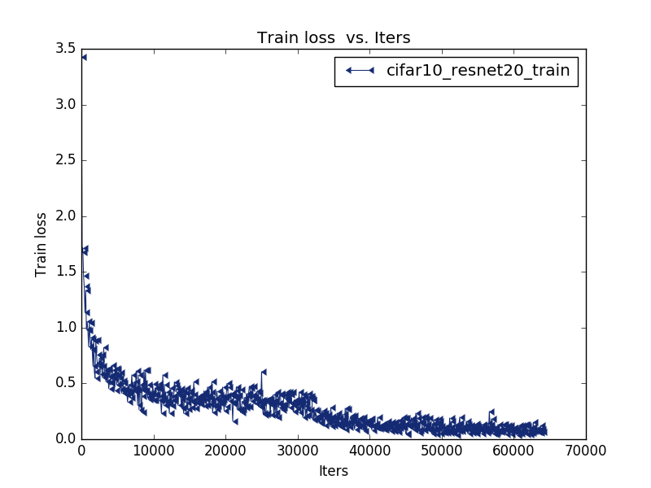
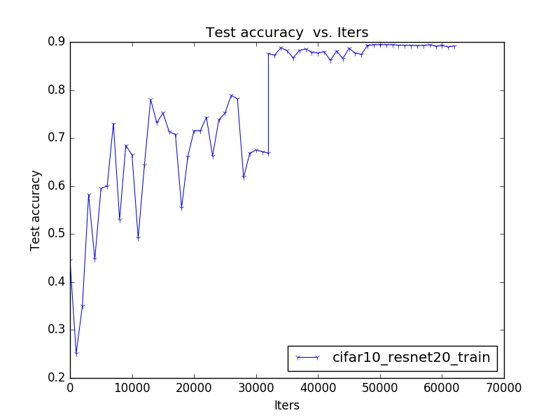
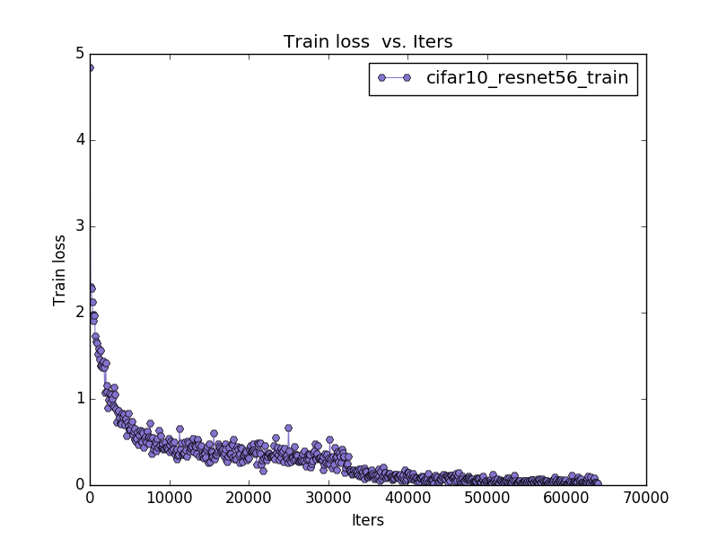
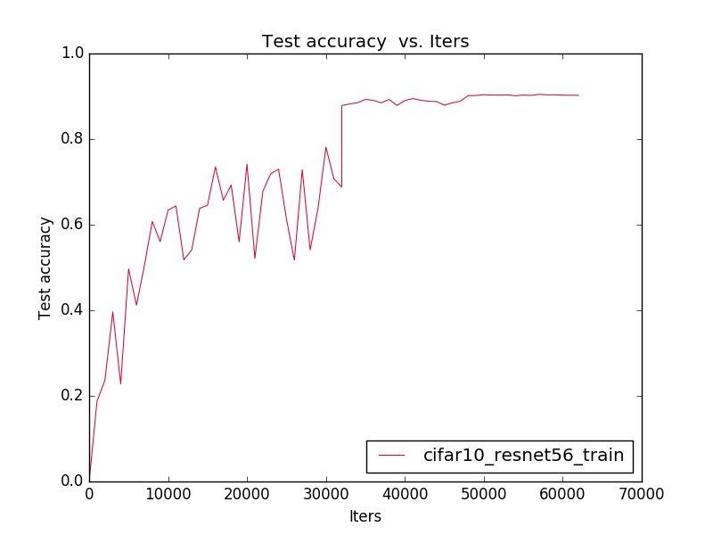

# 项目介绍
用pycaffe实现了《Deep Residual Learning for Image Recognition》提出的ResNet，并在cifar10数据集上训练模型。
该作者通过引入深度残差学习框架，解决了网络退化问题。
核心思想是通过拟合残差映射取代拟合潜在的映射，前者比后者更容易优化。
使用1x1 conv(bottleneck)降低了网络的计算复杂度。
使用《Batch normalization: Accelerating deep network training by reducing internal covariate shift》提出的Batch normalization减少internal covariate shift，允许使用更大的学习率，不再需要小心翼翼地初始化参数。

# 实验步骤

将cifar10数据库转换成lmdb数据库文件

用create_resnet.py生成训练测试网络文件，然后用github上的netscope检查生成的训练测试网络文件是否正确

用create_solver.py生成solver文件

用train_net.py进行模型训练

用caffe/tools下的log分析工具分析log文件，得到训练误差变化曲线和准确率变化曲线

# 实验结果

## ResNet20
### 训练误差

### 准确率

## ResNet56
### 训练误差

### 准确率

